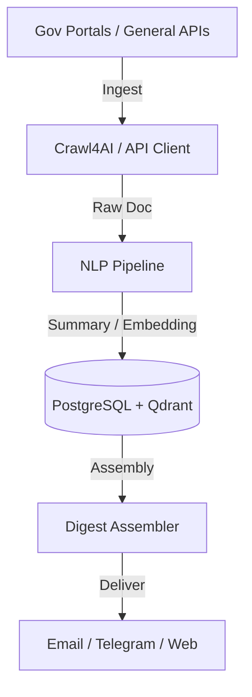

# 🏛️ AIPulse India

**Empowering Indian Citizens with Deterministic Intelligence from Government and General Sources.**

AIPulse is a production-grade, extensible platform that ingests official Indian government notifications and general public interest data from dozens of sources, enriches them with AI-powered insights, and delivers personalized daily digests.

[](https://opensource.org/licenses/MIT)
[](https://www.python.org/downloads/release/python-3120/)
[](https://www.docker.com/)

---

## 🌟 The Challenge & Our Solution

Modern information portals are often dynamic "React/Liferay black boxes." Standard scrapers fail due to inconsistent slugs, dynamic rendering, and hidden metadata.

AIPulse takes a **deterministic approach**:
1.  **Reverse-Engineering internal APIs:** We bypass brittle DOM parsing and query the same Headless CMS endpoints used by the portal frontends.
2.  **Taxonomy Mapping:** We use backend Category IDs to filter relevant updates and legal notifications from noise.
3.  **100% Accuracy:** By using internal document library paths and direct API access, we eliminate 404 errors and ensure 1:1 matching with official sources.

---

## 🚀 Key Features

-   **Multi-Source Deterministic Ingestion:** RSS, OData APIs, and robust browser-mimic crawling across government and general news sources.
-   **AI-Powered NLP Pipeline:**
    *   **Classification:** Automatic categorization (Jobs, Tax, Health, General News, etc.).
    *   **Dual-Language Summarization:** Quick-takes in both **English & Hindi**.
    *   **Impact Assessment:** Triage notifications by impact level (Critical/High/Medium).
-   **Smart Deduplication:** Multi-layer engine using exact hash, near-duplicate (MinHash/LSH), and semantic checks.
-   **Personalized Delivery:** Daily digests via **Email (SendGrid)** and **Telegram**, tailored to user interests.
-   **Modern Frontend:** High-performance dashboard with full search and language toggling.

---

## 🛠️ Tech Stack

-   **Backend:** FastAPI (Python 3.12)
-   **Task Engine:** Celery & Redis
-   **Database:** PostgreSQL (Relational) & Qdrant (Vector/Semantic Search)
-   **LLM Orchestration:** LiteLLM (Gemini 1.5, GPT-4o)
-   **Crawling:** Crawl4AI, Playwright (Stealth), Feedparser
-   **Proxy Management:** Automated rotation of high-quality free proxies.

---

## 📦 Architecture



---

## 🛠️ Installation & Setup

1.  **Clone the Repo:**
    ```bash
    git clone https://github.com/bhavik-mangla/aipulse-backend.git
    cd aipulse-backend
    ```

2.  **Environment Setup:**
    ```bash
    cp .env.example .env
    # Add your API keys (Google Gemini, SendGrid, etc.)
    ```

3.  **Start Services:**
    ```bash
    docker-compose up -d --build
    ```

4.  **Initial Seed:**
    ```bash
    docker-compose exec api python scripts/seed_sources.py
    ```

---

## 📝 License

Distributed under the MIT License. See `LICENSE` for more information.

---

## 🤝 Contributing

Contributions are welcome! Whether it's adding a new source or improving the NLP pipeline, feel free to open a PR.

*Built with ❤️ for a more informed India.*
