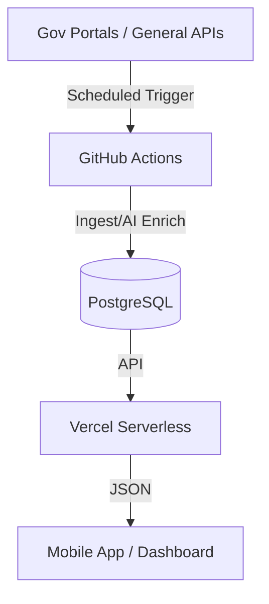

# 🏛️ AIPulse

**Stay Informed with Curated General News and Official Government Sources.**

AIPulse is a production-grade, extensible platform that ingests general public interest news and official government notifications from dozens of sources, enriches them with AI-powered insights, and provides them via a modern web interface.

---

## 📥 Get the App

### **iOS (Public Beta)**
<a href="https://apps.apple.com/us/app/ai-pulse-daily-short-news/id6770227108">
  
</a>

### **Android (Closed Testing)**
To test the Android version, follow these steps:
1. **Join the Testers Group**: [Join Google Group](https://groups.google.com/g/ai-pulse-testers) (Required for access).
2. **Opt-in to Testing**: [Enable Testing on Play Store](https://play.google.com/apps/testing/com.daily.aipulse).
3. **Download**: [Get it on Google Play](https://play.google.com/store/apps/details?id=com.daily.aipulse).

**Mobile App Repository:** [ai-pulse-app](https://github.com/bhavik-mangla/ai-pulse-app)

---

[](https://opensource.org/licenses/MIT)
[](https://www.python.org/downloads/release/python-3120/)
[](https://www.docker.com/)

---

## 🌟 The Challenge & Our Solution

Modern information portals are often dynamic "React/Liferay black boxes." Standard scrapers fail due to inconsistent slugs, dynamic rendering, and hidden metadata.

AIPulse takes a **deterministic approach**:
1.  **Reverse-Engineering internal APIs:** We bypass brittle DOM parsing and query the same Headless CMS endpoints used by the portal frontends.
2.  **Taxonomy Mapping:** We use backend Category IDs to filter relevant updates and legal notifications from noise.
3.  **100% Accuracy:** By using internal document library paths and direct API access, we eliminate 404 errors and ensure 1:1 matching with official sources.

---

## 🚀 Key Features

-   **Serverless Deterministic Ingestion:** Runs entirely on **GitHub Actions**, bypassing the need for dedicated servers for crawling and ingestion.
-   **Zero-Cost Maintenance:** Orchestrated to run 100% free using Vercel (API), GitHub Actions (Cron Workers), and free-tier databases.
-   **AI-Powered NLP Pipeline:**
    *   **Classification:** Automatic categorization (Jobs, Tax, Health, General News, etc.).
    -   **Dual-Language Summarization:** Quick-takes in both **English & Hindi**.
    -   **Impact Assessment:** Triage notifications by impact level (Critical/High/Medium).
-   **Smart Visuals:** Automated image enrichment via Wikipedia API fallback and unified logo mapping for government portals.
-   **Multi-Source Ingestion:** RSS, OData APIs, and robust browser-mimic crawling using Playwright.

---

## 🛠️ Tech Stack

-   **Backend:** FastAPI (Python 3.12) - Hosted on Vercel
-   **Orchestration:** GitHub Actions (for scheduled serverless ingestion)
-   **Database:** PostgreSQL (Relational)
-   **LLM Orchestration:** LiteLLM (Gemini 1.5, GPT-4o)
-   **Crawling:** Crawl4AI, Playwright (Stealth), Feedparser
-   **Images:** Wikipedia API for fallback news visuals

---

## 📦 Architecture


```mermaid
graph TD
    Sources[Gov Portals / General APIs] -->|Scheduled Trigger| GHA[GitHub Actions]
    GHA -->|Ingest/AI Enrich| DB[(PostgreSQL)]
    DB -->|API| Vercel[Vercel Serverless]
    Vercel -->|JSON| App[Mobile App / Dashboard]
```

---

## 🛠️ Installation & Setup

1.  **Clone the Repo:**
    ```bash
    git clone https://github.com/bhavik-mangla/aipulse-backend.git
    cd aipulse-backend
    ```

2.  **Environment Setup:**
    ```bash
    cp .env.example .env
    # Add your API keys (Google Gemini, SendGrid, etc.)
    ```

3.  **Start Services:**
    ```bash
    docker-compose up -d --build
    ```

4.  **Initial Seed:**
    ```bash
    docker-compose exec api python scripts/seed_sources.py
    ```

---

## 📝 License

Distributed under the MIT License. See `LICENSE` for more information.

---

## 🤝 Contributing

Contributions are welcome! Whether it's adding a new source or improving the NLP pipeline, feel free to open a PR.

*Built with ❤️ for a more informed society.*
